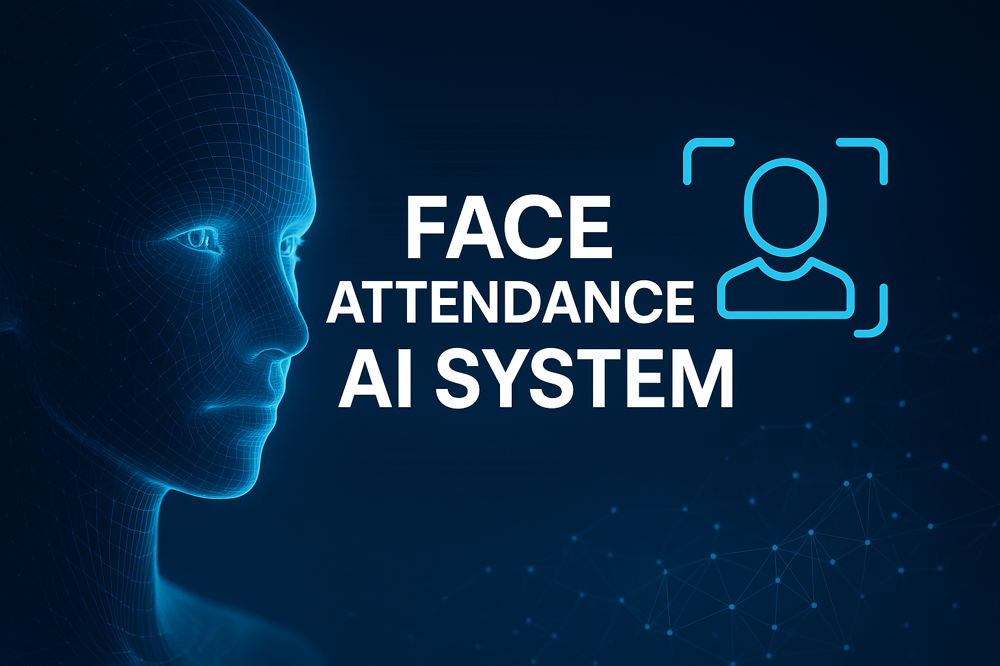

  <!-- Banner proiect -->
  

  <h1 style="font-size: 40px; margin-bottom: 0.2em;">📘 Etapa 3 – Analiza & Preprocesarea Datelor</h1>
  <h3 style="margin-top: 0;">Proiect: Face Attendance AI System</h3>

  <!-- Badges -->
  

    
    
    
    
  

 

  <strong>Student:</strong> Baba Cristian-Teodor 
  <strong>Disciplina:</strong> Rețele Neuronale – FIIR 
  <strong>Scopul etapei:</strong> Pregătirea unui set de date curat, standardizat și bine documentat pentru antrenarea rețelelor neuronale de recunoaștere facială, utilizate în sistemul AI de analiză automată a prezenței. În această etapă generăm și imagini sintetice (AI), atât cu fețe individuale, cât și cu poze de clasă, pentru a putea testa sistemul nu doar pe date reale, ci și pe scenarii simulate, controlate (amfiteatre, grupe mari, iluminare dificilă etc.).

---

## 🧭 1. Structura Repository-ului (Etapa 3)

<pre>
RN/
│
├── README.md
│
├── docs/
│   ├── datasets/                 # descriere seturi de date, surse, diagrame
│   └── Sistem_AI_Prezență_Studenți_FIIR_UPB_Baba_Cristian-Teodor.pptx
│
├── data/
├── raw/
│   ├── input-poze-clasa/         # poze cu clase, reale + generate AI
│   ├── input-poze-fete/          # poze individuale, reale + generate AI
│   ├── kaggle-real/              # imagini reale (5000) din Kaggle
│   └── kaggle-ai/                # imagini generate AI (4630) din Kaggle
│   │
│   ├── processed/                # fețe crop-uite, normalizate (Etapa 3)
│   │
│   ├── train/                    # (în Etapa 4) set de antrenare RN
│   ├── validation/               # (în Etapa 4) set de validare
│   └── test/                     # (în Etapa 4) set de test
│
├── src/
│   ├── preprocessing/
│   │   └── split_faces.py        # împărțire / extragere fețe din sprite-uri
│   │
│   ├── data_acquisition/         # (în viitor) captură din cameră, streaming / generare
│   │
│   ├── neural_network/
│   │   ├── web_app.py            # aplicația web (UI + upload + pipeline)
│   │   ├── face_embeddings.py    # generare embeddings 128D pentru fețe
│   │   ├── yolo_face_detector.py # detecție facială YOLO (preprocesare imagini)
│   │   ├── recognize_and_log.py  # recunoaștere + log CSV (varianta CLI)
│   │   │
│   │   ├── static/
│   │   │   ├── uploads/          # pozele încărcate din UI
│   │   │   └── results/          # imagini rezultate cu detecții & highlight
│   │   │
│   │   └── templates/
│   │       ├── index.html        # UI principal pentru recunoaștere
│   │       └── admin.html        # UI pentru administrare / înscriere fețe
│
├── models/
│   └── yolov11m.pt               # modelul YOLO pentru detecție facială
│
├── output/
│   └── prezenta.csv              # fișierul final cu prezența (exportat automat)
│
├── altele/                      # alte fișiere / experimente
│
└── requirements.txt              # dependențe Python
</pre>

---

## 🖼️ 2. Descrierea Setului de Date

  

    <h3>📍 Sursa Datelor</h3>
    <ul>
      <li><strong>input-poze-clasa/</strong> – cadre cu sala de curs, cu mai mulți studenți simultan, formate atât din <strong>poze reale</strong>, cât și din <strong>poze generate AI</strong> (simulare amfiteatru / laborator, grupe mari, bănci pline etc.);</li>
      <li><strong>input-poze-fete/</strong> – fotografii individuale pentru înscrierea fețelor cunoscute, provenite atât din <strong>capturi reale</strong>, cât și din <strong>imagini generate AI</strong> (fețe sintetice folosite pentru extinderea și echilibrarea dataset-ului);</li>
      <li><strong>Dataset extern – Human Faces Dataset (Kaggle)</strong> – set de date suplimentar, folosit pe lângă pozele realizate de student:
        <ul>
          <li><strong>5000 imagini reale</strong> (fotografii cu fețe umane reale);</li>
          <li><strong>4630 imagini generate AI</strong> (fețe sintetice);</li>
        </ul>
        Dataset-ul este folosit pentru a crește diversitatea distribuției de fețe și pentru a compara comportamentul modelului pe:
        <ul>
          <li>date reale proprii (poze făcute de autor),</li>
          <li>date reale externe (Kaggle),</li>
          <li>date sintetice (AI) – atât din Kaggle, cât și din generarea internă.</li>
      </li>
      <li>O parte din aceste imagini AI sunt generate special pentru <strong>testarea sistemului</strong> în scenarii mai greu de obținut în practică (de ex. săli foarte pline, unghiuri extreme, iluminare dificilă).</li>
      <li>În viitor: captură directă din cameră prin modulul <code>data_acquisition/</code>, care va putea genera atât imagini reale, cât și secvențe simulate pentru testare.</li>
    </ul>
    
<strong>Scop:</strong> Construirea unui set de date realist, dar și suficient de variat, prin combinarea imaginilor reale (proprii + Kaggle) cu imagini generate AI (proprii + Kaggle), pentru a antrena și <strong>a testa</strong> sistemul de prezență bazat pe recunoaștere facială în scenarii cât mai diverse.

  

  

    <h3>📊 Dimensiunea Dataset-ului</h3>
    <ul>
      <li>~200–300 imagini brute proprii (combinație între poze de clasă și poze individuale, <strong>reale + generate AI</strong>);</li>
      <li><strong>5000 imagini reale</strong> din Human Faces Dataset (Kaggle);</li>
      <li><strong>4630 imagini generate AI</strong> din Human Faces Dataset (Kaggle);</li>
      <li><strong>Total combinat:</strong> ≈ 9500+ imagini cu fețe (reale + sintetice);</li>
      <li>Format imagini: <strong>JPG / PNG</strong>;</li>
      <li>Rezoluție finală după preprocesare: <strong>224×224 px</strong> pe fiecare față detectată de YOLO.</li>
    </ul>
    
Imaginile sunt organizate pe persoane, pe tip (real / generat) și pe sursă (propriu / Kaggle), astfel încât să existe suficient material pentru antrenare, validare, test și pentru analiza comparativă între fețele reale și cele sintetice folosite la testare.

  

---

### 2.1 Caracteristici Numerice & Metadate

Embedding-urile și metadatele generate după preprocesare:

| Caracteristică | Tip      | Dimensiune | Descriere                                                  |
|----------------|----------|------------|------------------------------------------------------------|
| `embedding`    | numeric  | 128        | Vector de featuri generat de rețeaua neuronală pentru față |
| `confidence`   | numeric  | scalar     | Scor YOLO de încredere că zona detectată este o față       |
| `bbox`         | numeric  | 4 valori   | Coordonatele dreptunghiului de detecție (x1,y1,x2,y2)      |
| `synthetic`    | boolean  | scalar     | 0 = imagine reală, 1 = imagine generată AI                 |
| `person_id`    | categ.   | scalar     | ID-ul / numele persoanei (label de clasă, dacă e cunoscută)|

> Documentația detaliată se va afla în `docs/datasets/dataset_description.md`.

---

## 🔍 3. Analiza Exploratorie a Datelor (EDA)

  
<strong>🔎 Deschide analiza EDA (click aici)</strong>

 

### 3.1 Statistici Descriptive

Pe setul de imagini brute (reale + generate AI) și pe embedding-uri sunt analizate:

- numărul de imagini per persoană (distribuția etichetelor) pentru:
  - pozele proprii (real + AI),
  - imaginile reale din Human Faces Dataset (Kaggle),
  - imaginile AI din Human Faces Dataset (Kaggle);
- numărul de fețe detectate per fotografie de clasă;
- histogramă pe valori de <code>confidence</code> YOLO;
- distribuția dimensiunii bounding box-urilor (fețe foarte mici vs. foarte mari);
- analiza calității imaginilor (blur, iluminare, unghi, realism pentru imaginile AI);
- compararea distribuțiilor între imagini reale și imagini generate AI (atât din setul propriu, cât și din Human Faces Dataset Kaggle), pentru a vedea dacă setul sintetic este relevant pentru testare și cât de apropiat este de distribuția reală.

Exemple de observații:

- Persoanele au între 10 și 25 imagini utile fiecare (combinație real + AI în setul propriu);
- în Human Faces Dataset (Kaggle) există o acoperire mult mai bună ca diversitate (fețe, etnii, unghiuri, expresii);
- ~8–10% dintre imagini au <code>confidence</code> sub pragul stabilit și sunt marcate pentru excludere;
- anumite poze de clasă (mai ales generate) conțin fețe foarte îndepărtate → risc de embedding slăbuț;
- imaginile de test generate AI pot scoate în evidență situații-limită (unghiuri atipice, grupuri foarte mari), utile pentru evaluarea robustă a sistemului.

---

### 3.2 Analiza Calității Datelor

Sunt verificate următoarele probleme:

- imagini (reale sau AI, proprii sau din Kaggle) fără nicio față detectată;
- imagini cu fețe multiple care se suprapun sau sunt parțial acoperite;
- imagini extrem de întunecate, supraexpuse sau saturate;
- embedding-uri cu distanță prea mare față de restul clasei (posibile erori sau fețe sintetice nereușite);
- imagini generate AI care nu respectă anatomia / proporțiile umane (artefacte vizuale) → marcate pentru eliminare pentru a nu afecta testarea;
- diferențe de stil între fețele reale proprii, fețele reale Kaggle și fețele AI (Kaggle + interne), care sunt compensate prin normalizare și augmentare.

---

### 3.3 Probleme Identificate

- Iluminare neuniformă între seturile de poze, în special între poze generate și poze reale (diferențe de stil / contrast);
- Dezechilibru între persoane (unii studenți au mult mai multe imagini decât alții, mai ales pe partea reală din pozele proprii);
- O parte dintre fețele detectate în <code>input-poze-clasa/</code> sunt prea mici pentru o recunoaștere robustă;
- Câteva imagini (atât reale, cât și generate) conțin fețe neclare (motion blur) sau orientate la un unghi prea mare și sunt marcate pentru filtrare în etapa de curățare;
- anumite imagini AI (atât din Kaggle, cât și generate intern) folosite inițial pentru testare sunt respinse după analiză, pentru că nu produc embedding-uri consistente cu restul dataset-ului (nu ar testa corect sistemul, ci l-ar distorsiona).

---

## 🔧 4. Preprocesarea Datelor

  
<strong>🧼 4.1 Curățarea datelor (click pentru detalii)</strong>

 

<ul>
  <li>Detecție facială pentru fiecare imagine (reală sau generată AI, provenită din poze proprii sau din Human Faces Dataset Kaggle) folosind <code>yolov11m.pt</code> în <code>yolo_face_detector.py</code>;</li>
  <li>Filtrarea fețelor cu <strong>confidence</strong> sub un prag (ex. 0.65–0.70);</li>
  <li>Excluderea imaginilor fără fețe valide sau cu fețe mult prea mici în cadru;</li>
  <li>Excluderea cazurilor cu multe fețe suprapuse sau greu de separat;</li>
  <li>Eliminarea duplicatelor (aceeași imagine salvată de mai multe ori, inclusiv în varianta generată sau în datasetul extern);</li>
  <li>Filtrarea imaginilor generate AI care prezintă artefacte evidente sau fețe nereale, pentru a nu afecta testarea și antrenarea;</li>
  <li>Conversia formatelor și rezoluțiilor la un standard comun (JPG + rezoluție minimă acceptată).</li>
</ul>
Rezultatul acestei etape este salvat în <code>data/processed/</code> sub formă de imagini crop-uite cu fețele individuale (reale și AI, proprii + Kaggle), gata pentru pasul de embedding și pentru utilizarea lor în teste controlate.

---

  
<strong>✨ 4.2 Transformarea caracteristicilor & generarea embedding-urilor</strong>

 

  

    <h3>🧠 Embedding RN</h3>
    
Fiecare față preprocesată (reală sau generată AI, indiferent dacă provine din pozele proprii sau din Human Faces Dataset Kaggle) este trecută prin modelul de rețea neuronală (ex. FaceNet / DeepFace) implementat în <code>face_embeddings.py</code>, rezultând un vector numeric de dimensiune 128. Acest vector reprezintă „amprenta” feței în spațiul de featuri.

    
Embedding-urile se salvează într-o structură de tip:
     <code>data/embeddings/{person_id}/face_01.npy</code>

    
Pentru fețele generate AI (atât interne, cât și cele din Kaggle), se verifică suplimentar dacă embedding-urile se aliniază cu distribuția embedding-urilor reale, iar cele care ies puternic din distribuție sunt marcate ca outlier și pot fi eliminate, astfel încât imaginile AI folosite la test să fie cât mai apropiate de scenarii reale.

  

  

    <h3>📏 Normalizare & Crop</h3>
    <ul>
      <li>Decupare fețe pe baza bounding box-ului YOLO (pentru imagini reale și AI, proprii + Kaggle);</li>
      <li>Redimensionare la <strong>224×224 px</strong> pentru toate fețele;</li>
      <li>Conversie BGR → RGB și normalizare valori pixel (de ex. în intervalul [0,1]);</li>
      <li>Opțional: eliminarea zgomotului, corecții de contrast sau augmentări ușoare (rotiri, flip, ușor blur) aplicate atât pe imagini reale, cât și pe imagini generate, pentru a simula condiții cât mai apropiate de realitate în testele viitoare.</li>
    </ul>
    
Aceste transformări asigură consistența datelor de intrare pentru modelul neuronal, indiferent dacă fața provine dintr-o poză reală (proprie sau Kaggle) sau dintr-una generată AI, și permit testarea sistemului în condiții controlate.

  

---

  
<strong>📦 4.3 Împărțirea seturilor Train / Validation / Test</strong>

 

  <h3>Proporții utilizate</h3>
  <ul>
    <li>70% — <strong>Train</strong> (antrenare model RN pe embedding-uri, folosind atât imagini reale, cât și o proporție controlată de imagini generate AI, din toate sursele – proprii + Kaggle);</li>
    <li>15% — <strong>Validation</strong> (tuning hyperparametri, early stopping, inclusiv teste pe imagini generate AI pentru a verifica generalizarea);</li>
    <li>15% — <strong>Test</strong> (evaluare finală, preferabil pe imagini reale, eventual completate cu câteva scenarii AI construite special pentru stresarea sistemului).</li>
  </ul>
  <h4>Principii respectate:</h4>
  <ul>
    <li>Stratificare pe <code>person_id</code> astfel încât fiecare persoană să apară în toate seturile, dar cu imagini diferite;</li>
    <li>Fără scurgere de informație (no data leakage) între <code>train</code>, <code>validation</code> și <code>test</code>;</li>
    <li>Imaginile generate AI sunt folosite în principal pentru <strong>train</strong> și <strong>validation</strong>, iar pentru <strong>testul final</strong> se folosesc mai ales imagini reale (proprii + Kaggle), plus câteva scenarii AI gândite explicit pentru a testa limitele sistemului;</li>
    <li>Statisticile de normalizare și eventualele transformări se calculează exclusiv pe <strong>train</strong> și apoi se aplică pe <strong>val/test</strong>.</li>
  </ul>
  
Seturile rezultate sunt salvate în folderele <code>data/train/</code>, <code>data/validation/</code> și <code>data/test/</code>, respectiv în fișiere CSV / JSON cu liste de căi + etichete, fiind utilizate ulterior atât pentru antrenare, cât și pentru testarea comportamentului sistemului în scenarii reale și simulate.

---

## 📁 5. Fișiere Generate în Etapa 3

<ul>
  <li>📂 <code>data/raw/</code> – imagini brute (poze de clasă + poze individuale, reale + generate AI, proprii + Kaggle);</li>
  <li>📂 <code>data/processed/</code> – fețe decupate și normalizate, gata pentru embedding;</li>
  <li>📂 <code>data/embeddings/</code> – vectori 128D pentru fiecare față (organizați pe persoane / surse / tip real vs. synthetic);</li>
  <li>📂 <code>data/train/</code>, <code>data/validation/</code>, <code>data/test/</code> – împărțirea finală a datelor pentru antrenare și testare (incluzând, la nevoie, seturi speciale de test AI);</li>
  <li>📂 <code>src/preprocessing/</code> – scripturi dedicate tăierii și pregătirii fețelor (ex. <code>split_faces.py</code> și, în viitor, scripturi pentru generare de imagini AI);</li>
  <li>📂 <code>src/neural_network/</code> – codul de detecție, embedding și recunoaștere (<code>yolo_face_detector.py</code>, <code>face_embeddings.py</code>, <code>recognize_and_log.py</code>);</li>
  <li>📄 <code>docs/datasets/dataset_description.md</code> – descriere detaliată a dataset-ului (de completat, incluzând sursa Kaggle și pozele proprii);</li>
  <li>📄 <code>docs/Sistem_AI_Prezență_Studenți_FIIR_UPB_Baba_Cristian-Teodor.pptx</code> – prezentarea oficială cu descrierea sistemului și a etapelor de lucru;</li>
  <li>📄 <code>config/preprocessing.yaml</code> – praguri de confidence, dimensiuni, și parametri de preprocesare (opțional).</li>
</ul>

---

## ✅ 6. Stare Etapă (to-do list GitHub)

- [x] Structură repository configurată pentru Etapa 3  
- [x] Colectare imagini brute în `data/raw/` (reale + generate AI, proprii + Kaggle)  
- [x] Detecție facială + crop fețe în `data/processed/`  
- [x] Generare embeddings (vectori 128D) în `data/embeddings/`  
- [ ] Împărțire finală Train / Validation / Test salvată în folder-ele dedicate  
- [ ] Documentație completă în `docs/datasets/dataset_description.md`  
- [ ] Export PDF / DOC pentru predarea oficială (opțional)  

---
